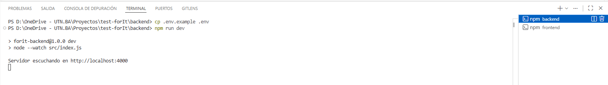
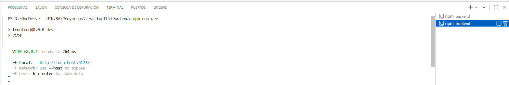
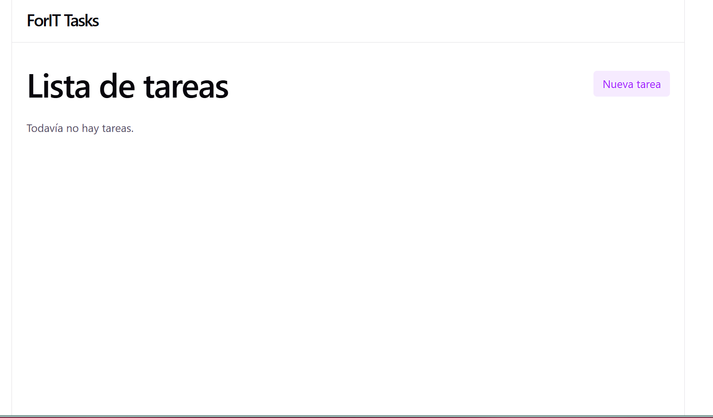
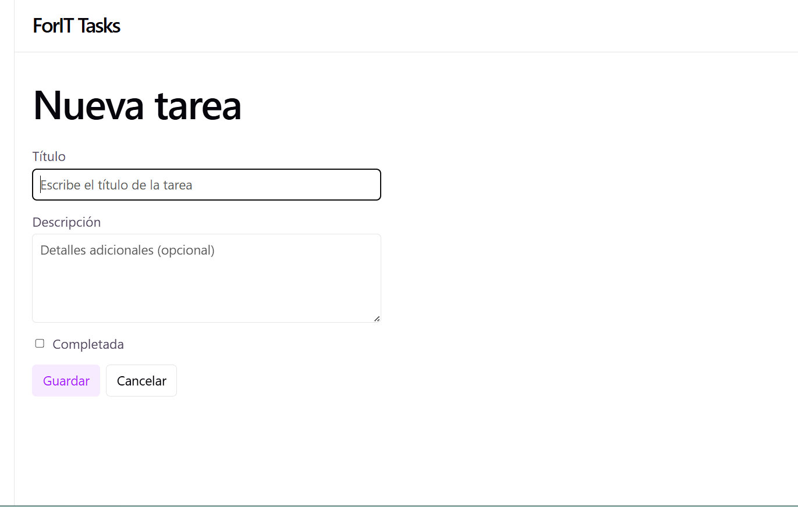
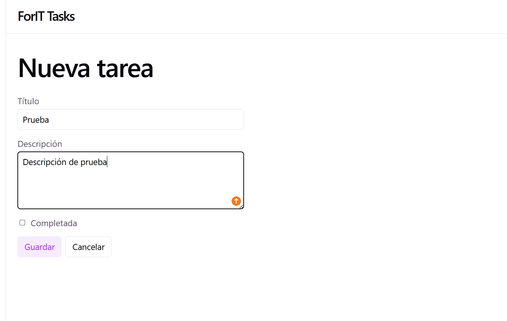
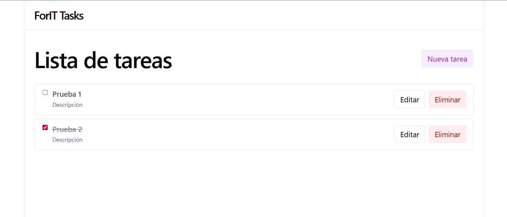
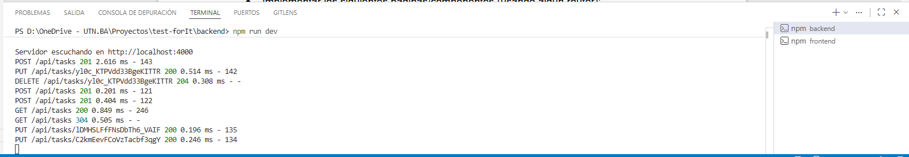

# Challenge ingreso a Academia ForIT

Aplicación de lista de tareas (todo list) para el **Challenge ingreso a Academia ForIT 2025**, construida con **Node.js + Express** en el backend y **React + Vite** en el frontend.

## Estructura del proyecto

- [backend](backend): API REST en Express.
- [frontend](frontend): SPA en React creada con Vite.

## Requisitos previos

- Node.js 20+ (se recomienda LTS).
- npm (incluido con Node).

## Backend

### Instalación

```bash
cd backend
npm install --legacy-peer-deps
```

> Nota: se usa `--legacy-peer-deps` para resolver el conflicto de dependencias entre `eslint` y `eslint-config-standard`.

### Configuración de entorno

Copiá el archivo de ejemplo y ajustá los valores si lo necesitás:

```bash
cd backend
cp .env.example .env   # En Windows PowerShell: Copy-Item .env.example .env
```

Variables disponibles (ver [backend/.env.example](backend/.env.example)):

- `PORT`: puerto del servidor (por defecto `4000`).

### Scripts útiles

- Desarrollo (con recarga):

  ```bash
  cd backend
  npm run dev
  ```

- Producción / ejecución simple:

  ```bash
  cd backend
  npm start
  ```

- Lint del backend (ESLint):

  ```bash
  cd backend
  npm run lint
  ```

La API quedará disponible (por defecto) en:

- `GET  http://localhost:4000/api/tasks`
- `POST http://localhost:4000/api/tasks`
- `PUT  http://localhost:4000/api/tasks/:id`
- `DELETE http://localhost:4000/api/tasks/:id`

## Frontend

### Instalación

```bash
cd frontend
npm install
```

### Configuración de entorno

En [frontend/.env](frontend/.env) se configura la URL base de la API:

```bash
VITE_API_URL=http://localhost:4000
```

Si cambiás el puerto o el host del backend, actualizá este valor.

### Scripts útiles

- Desarrollo:

  ```bash
  cd frontend
  npm run dev
  ```

  Por defecto se levanta en `http://localhost:5173/`.

- Build de producción:

  ```bash
  cd frontend
  npm run build
  ```

- Preview (sobre el build):

  ```bash
  cd frontend
  npm run preview
  ```

- Lint del frontend (ESLint):

  ```bash
  cd frontend
  npm run lint
  ```

## Flujo básico de uso

1. Levantá el backend:

   ```bash
   cd backend
   npm install --legacy-peer-deps
   npm run dev
   ```

2. En otra terminal, levantá el frontend:

   ```bash
   cd frontend
   npm install
   npm run dev
   ```

3. Abrí `http://localhost:5173/` en el navegador.

Desde la UI vas a poder:

- Listar tareas.
- Crear nuevas tareas.
- Editar tareas existentes.
- Marcar tareas como completadas.
- Eliminar tareas.

## Notas sobre el challenge

- El backend implementa un almacenamiento **en memoria** en [backend/src/tasksStore.js](backend/src/tasksStore.js), cumpliendo con la estructura de `Task` pedida (id, title, description, completed, createdAt).
- El frontend utiliza **React Router** para las rutas `/tasks`, `/tasks/new` y `/tasks/:id/edit`.
- La comunicación entre frontend y backend se hace mediante `fetch` desde [frontend/src/api/tasksApi.js](frontend/src/api/tasksApi.js) usando la variable de entorno `VITE_API_URL`.

## Capturas de pantalla de como funciona la aplicación

- Backend en modo desarrollo (`npm run dev`):

  

- Frontend en desarrollo con Vite (`npm run dev`):

  

- Lista de tareas sin elementos (estado inicial):

  

- Formulario "Nueva tarea" vacío:

  

- Creación de una tarea con título y descripción:

  

- Frontend con lista de tareas:

  

- Registro de peticiones HTTP en el backend (GET/POST/PUT/DELETE sobre `/api/tasks`):

  
